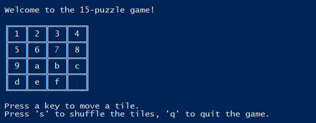
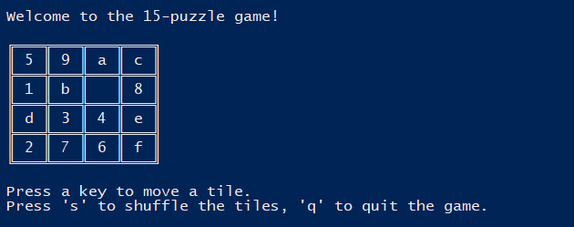
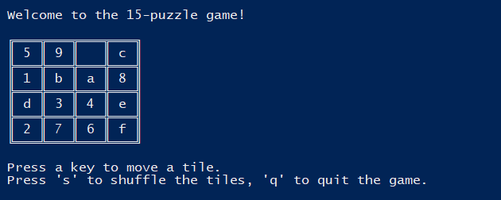
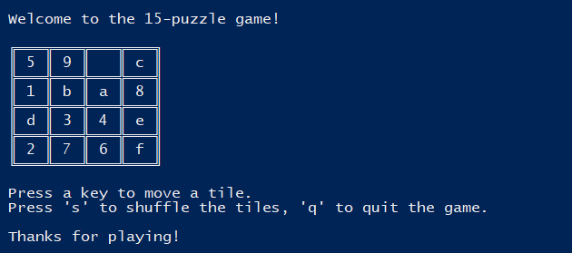

    

    
This is the starting prompt. Pressing any key starts the game.
 
        

        
This is the starting board. It always starts on a sorted screen.
 
        

        
After pressing 's' the board shuffles to a random orientation. A user can shuffle any numbe of times.
 
        

        
After pressing 'a' (using the board above as an example), the tiles shift accordingly to the orientation. A user can select any of the available characters, and the board will update if a valid change is available.
 
        

        
Exiting message on either quit, or success.
 
    

