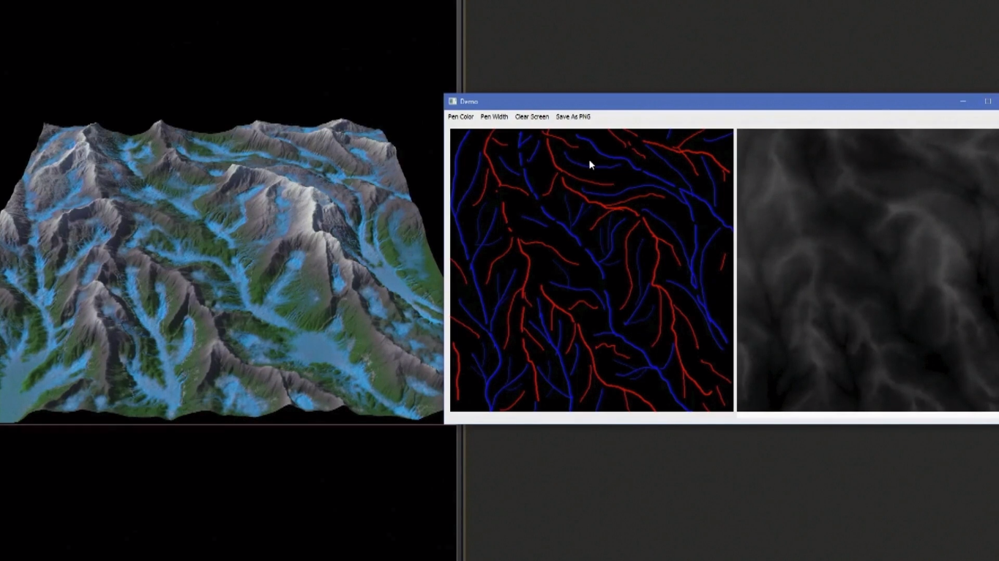

    

   		
This demo illustrated the ability to synthesis data with PDG, and perform enhanced training to result in significantly increased speeds towards operations such as erosion.
 
        

            

    	        
Terrain Generation Demo

            

        

        
This demo revealed the data preprocessing techniques within PDG. It also shows an highly practical application of machine learning in artists' perspectives, and the ability to offer a spectrum of users technologies that have been tailored to their scopes of knowledge.
 
    

