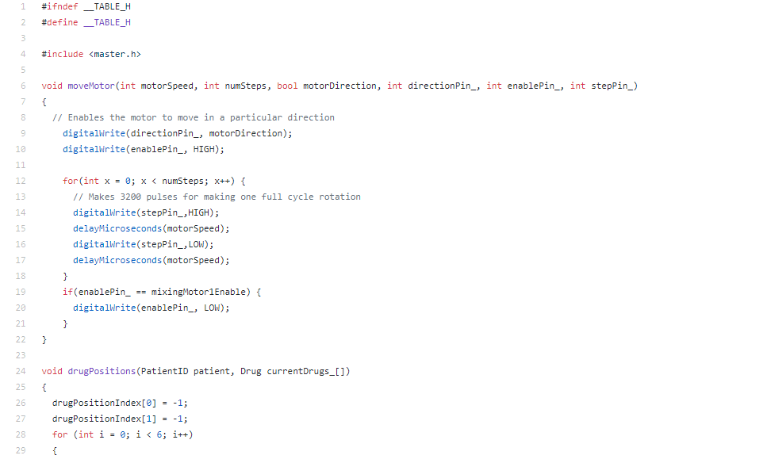

    

   		
This is the complete CAD assembly of the prototype device.
 
        

        	

		        
High Fidelity Prototype

		        

	    	

        
This is the functional, working prototype.
 
        

        

        
This is a sample of the Arduino code.

    

